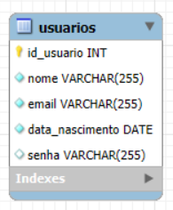

# PHP CRUD
<p>Esse é um projeto que desenvolvi em linguagem php para fazer o crud de usuários.</p>

<p style="font-size: 24px;">Cadastrando usuário ✅</p>
<video src="./assets/video/usuario_create.mp4" width="700" height="360" autoplay muted loop>
</video>

<p style="font-size: 24px;">Visualizando usuário 👀</p>
<video src="./assets/video/usuario_view.mp4" width="700" height="360" autoplay muted loop>
</video>

<p style="font-size: 24px;">Editando usuário 📝</p>
<video src="./assets/video/usuario_edit.mp4" width="700" height="360" autoplay muted loop>
</video>

<p style="font-size: 24px;">Deletando usuário ❌</p>
<video src="./assets/video/usuario_delete.mp4" width="700" height="360" autoplay muted loop>
</video>

<p style="font-size: 24px;">Modelagem do Banco de Dados 📊</p>


## Tecnologias utilizadas
<table>
  <tr>
    <td width="50">
      
    </td>
    <td>
      HTML: Estrutura da página web
    </td>
  </tr>

  <tr>
    <td width="50">
      
    </td>
    <td>
      TailwindCSS: Estilização da página web
    </td>
  </tr>

  <tr>
    <td width="50">
      
    </td>
    <td>
      PHP: Backend da página web
    </td>
  </tr>

  <tr>
    <td width="50">
      
    </td>
    <td>
      MySQL: Banco de dados
    </td>
  </tr>
</table>

## Vídeo tutorial
```
https://www.youtube.com/watch?v=aIQXgNmx_ug
```