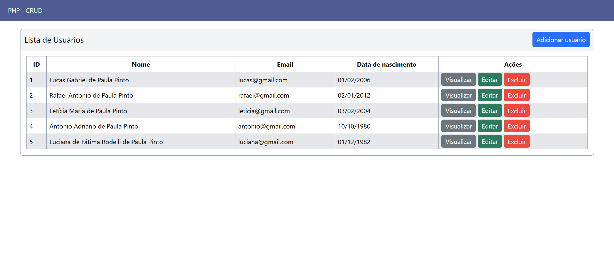

# PHP CRUD
<p>Esse é um projeto que desenvolvi em linguagem php para fazer o crud de usuários.</p>



<p style="font-size: 24px;">Modelagem do Banco de Dados 📊</p>


<br><br>

## Ações do sistema (CRUD)
<ul>
  <li>Criar usuário ✅</li>
  <li>Ler dados do usuário 👀</li>
  <li>Editar usuário 📝</li>
  <li>Deletar usuário ❌</li>
</ul>

<br><br>

## Tecnologias utilizadas
<table>
  <tr>
    <td width="50">
      
    </td>
    <td>
      HTML: Estrutura da página web
    </td>
  </tr>

  <tr>
    <td width="50">
      
    </td>
    <td>
      TailwindCSS: Estilização da página web
    </td>
  </tr>

  <tr>
    <td width="50">
      
    </td>
    <td>
      PHP: Backend da página web
    </td>
  </tr>

  <tr>
    <td width="50">
      
    </td>
    <td>
      MySQL: Banco de dados
    </td>
  </tr>
</table>

<br><br>

## Vídeo tutorial
```
https://www.youtube.com/watch?v=aIQXgNmx_ug
```